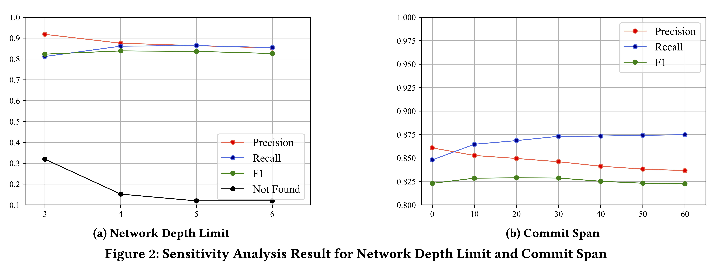

# Abstract
Open source software (OSS) vulnerability management has become an open problem. Vulnerability databases provide valuable data that is needed to address OSS vulnerabilities. However, there arises a growing concern about the information quality of vulnerability databases. In particular, it is unclear how the quality of patches in existing vulnerability databases is. Further, existing manual or heuristic-based approaches for patch identification are either too expensive or too specific to be applied to all OSS vulnerabilities.

To address these problems, we **first** conduct an empirical study to understand the quality and characteristics of patches for OSS vulnerabilities in two state-of-the-art vulnerability databases. Our study is designed to cover five dimensions, i.e., the **coverage, consistency, type, cardinality and accuracy** of patches. **Then**, inspired by our study, we propose the first automated approach, named **Tracer, to find patches for an OSS vulnerability from multiple sources**. Our key idea is that patch commits will be frequently referenced during the reporting, discussion and resolution of an OSS vulnerability.

Our extensive evaluation has indicated that **i)** Tracer finds patches for up to 273.8% more CVEs than **existing heuristic-based approaches** while achieving a significantly higher F1-score by up to 116.8%; and **ii)** Tracer achieves a higher recall by up to 18.4% than **state-of-the-art vulnerability databases**, but sacrifices up to 12.0% fewer CVEs (whose patches are not found) and 6.4% lower precision. Our evaluation has also demonstrated the **generality and usefulness** of Tracer.

The paper has been submitted to ICSE 2022. This page lists the supplementary materials that are omitted from the paper due to space limitations, (i.e., dataset, accuracy, sensitivity, and application analysis), and releases the experimental data and Tracer's source code.

**Table of Contents**

- [Abstract ](#abstract)
- [Source Code](#source-code)
- [Experimental Data](#experimental-data)
  + [Empirical Study](#empirical-study)
    * [Breadth Dataset](#breadth-dataset)
    * [Depth Dataset](#depth-dataset)
  + [Evaluation](#evaluation)
    * [Generality Evaluation](#generality-evaluation)
    * [Usefulness Evaluation](#usefulness-evaluation)
- [Supplementary Materials](#supplementary-materials)
  + [Dataset Analysis](#dataset-analysis)
  + [Accuracy Analysis](#accuracy-analysis)
  + [Sensitivity Analysis](#sensitivity-analysis)
  + [Application Analysis](#application-analysis)

# Source Code

You can download the source code of Tracer from [here](https://github.com/patch-tracer/patch-tracer.github.io/tree/main/Tracer%20Code).

# Experimental Data

### Empirical Study
##### Breadth Dataset
We built a breadth dataset of OSS vulnerabilities by acquiring all open source vulnerabilities from `$DB_A$`​ and `$DB_B$`​ as of April 7, 2020. We obtained 8,630 and 5,858 CVEs from `$DB_A$`​ and `$DB_B$`​​ respectively. 

#####  Depth Dataset

For each CVE, two of the authors separately found its patches by analyzing patches reported by the three databases, looking into CVE description and references in NVD, and searching GitHub repositories and Internet resources. Then, they exchanged sources and ways to find patches. After that, another author participated in. They investigated inconsistent cases together, and revisited all CVEs for several rounds until reaching a consensus. Finally, they successfully found patches for 1,295 CVEs. 

Both Breadth Dataset and Depth Dataset can be found [here](https://github.com/patch-tracer/patch-tracer.github.io/tree/main/Experimental%20Data/Empirical%20Study). 

### Evaluation
#####  Generality Evaluation
To evaluate the generality of Tracer to a wider range of OSS vulnerabilities, We construct two more datasets [here](https://github.com/patch-tracer/patch-tracer.github.io/tree/main/Experimental%20Data/Evaluation/Generality%20Evaluation%20datasets). 
#####  Usefulness Evaluation
To evaluate the usefulness of Tracer in practice, we conducted a user study with 10 participants to find patches of 10 CVEs. The 10 tasks can be found [here](https://github.com/patch-tracer/patch-tracer.github.io/tree/main/Experimental%20Data/Evaluation/Usefulness%20Evaluation%20tasks). 

# Supplementary Materials
### Dataset Analysis

We analyzed the 1,295 CVEs in our depth dataset with respect to years and programming languages. We determined the programming language of a CVE by analyzing the changed source files in patches. As shown in Fig.1a, the number of CVEs increases every year, which is consistent with [Snyk’s report](https://snyk.io/wp-content/uploads/sooss_report_v2.pdf). As reported in Fig. 1b, these CVEs mainly cover seven programming languages, which demonstrates relatively good coverage of ecosystems. Therefore, we believe that our depth dataset is representative of OSS vulnerabilities.

### Accuracy Analysis

We analyzed the intersection between the patches identified by Tracer (denoted as `$P_Tracer$`) and our manually identified patches (denoted as `$P_GT$` ) for each CVE in our depth dataset. In particular, we classify intersection relationships into six categories, which are used as another indicator of patch accuracy. The results are reported in Table 1, where the first column lists the six categories, the second column shows the number of CVEs belonging to each category, and the last column gives the total number of patches found by Tracer. 

It can be observed that Tracer can find patches accurately and completely for 773 (59.7%) CVEs (i.e., `$P_Tracer$ = $P_GT$`), with an average of 1.9 found patches for each CVE. Tracer can find patches completely but include some false positives for 128 (9.9%) CVEs (i.e., `$P_Tracer$ ⊃ $P_GT$`). In that sense, 901 (69.6%) CVEs’ patches are completely found by Tracer. Besides, Tracer can find patches accurately but have some false negatives for 139 (10.7%) CVEs (i.e., `$P_Tracer$ ⊂ $P_GT$`). Tracer incurs both false positives and false negatives for 27 (2.1%) CVEs (i.e., `$P_Tracer$ ∩ $P_GT$ \not= ∅`), while the patches found for 73 (5.6%) CVEs by Tracer are all false positives (i.e.,` $P_Tracer$ ∩ $P_GT$= ∅`). Notice that we analyze the reasons for false positives and false negatives in the submitted paper. These results demonstrate the capability of Tracer in finding patches accurately and completely.

### Sensitivity Analysis

Tracer has two configurable parameters, i.e., the network depth limit in the first step of Tracer and the commit span in the third step. The default configuration is 5 and 30, which is used in the evaluation for **RQ6, RQ7, RQ8 and RQ9**. To evaluate the sensitivity of Tracer to the two parameters, we reconfigured one parameter and fix the other, and reran Tracer against our depth dataset. Specifically, the network depth limit was configured from 3 to 6 by a step of 1, and the commit span was configured from 0 to 60 by a step of 10. 

Fig. 2a and 2b show the impact of the two parameters on the accuracy of Tracer, where x-axis denotes the value of the parameter, and y-axis denotes the accuracy of Tracer. Overall, as the network depth limit increases, more potential patches are included in our reference network. The number of CVEs that Tracer finds no patch and precision decrease, and recall and F1-score first increase and then decrease. Hence, we believe 5 is a good value for the network depth limit. As the commit span increases, a wider scope of commits are searched. Precision decreases, recall increases, and F1-score first increases and then decreases. Notice that the number of CVEs Tracer finds no patch will not change and thus is not presented in Fig. 2b. Hence, we believe 30 is a good value for the commit span. These results indicate that the sensitivity of the accuracy of Tracer to the two configurable parameters is acceptable.

### Application Analysis

Tracer is configurable to meet different accuracy requirements of applications. For applications that need **high patch precision**, Tracer can be configured to not construct the reference network in a layered way but simply use the direct references contained in the four advisory sources (i.e., skipping reference analysis in the first step). As shown by our ablation analysis in the submitted paper, this is actually the variant `$v^5_1$` , and achieves the highest precision of 0.918, 6.3% higher than that of the original Tracer.

For applications that need **high patch recall**, Tracer can be configured to not follow the patch selection step in Tracer but select all patches in our reference network. As shown by our ablation analysis in the submitted paper, this is actually the variant `$v^1_2$` , and achieves the highest recall of 0.940, 8.8% higher than that of the original Tracer. 

These results demonstrate that the two variants of Tracer can meet the practical requirements of high precision and high recall.

<!-- ### Jekyll Themes   -->

<!-- Your Pages site will use the layout and styles from the Jekyll theme you have selected in your [repository settings](https://github.com/TracerTool/TracerTool.github.io/settings/pages). The name of this theme is saved in the Jekyll `_config.yml` configuration file.   -->

<!-- ### Support or Contact   -->

<!-- Having trouble with Pages? Check out our [documentation](https://docs.github.com/categories/github-pages-basics/) or [contact support](https://support.github.com/contact) and we’ll help you sort it out.   -->